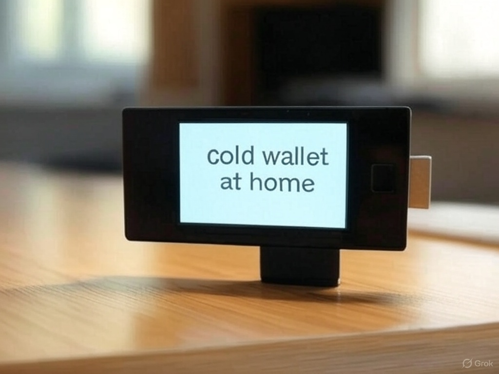

# ColdWalletAtHome

## Overview
**ColdWalletAtHome** is an Ethereum cold wallet designed for early-stage development. It is tailored for Linux users (I used WSL) and does not include a graphical user interface (GUI). This project provides a script that handles the signing process offline, effectively acting as a cold wallet when saved on a USB drive.

## Concept
The idea behind this project stems from the availability of various hardware wallet devices. I thought, "Why not create my own wallet using a USB drive?" After dedicating a week to learning about blockchain signing, elliptic curve cryptography, and related concepts, I developed this solution.

## How It Works
The provided Python script manages transactions and operates as a cold wallet. To ensure security, store the script on a LUKS-encrypted USB drive that is protected by a passphrase.

## TL;DR
1. Set up a new wallet on a USB drive.
2. Use the Python script to sign transactions.
3. Configure an Etherscan API key to eliminate the need for a JSON-RPC node.
4. The script generates a QR code that can be scanned to send an Etherscan request with the signed transaction hash. For enhanced privacy, use this tool offline.
# Setup
clone the project using 
```git clone https://github.com/ck159king/ColdWalletAtHome.git```

Check the location of your pendrive by using
```lsblk```

Run ``` python3 ColdWallet.py ```
provide it the data


### Important Note
- The current API URLs are configured for the Sepolia testnet. To switch to the mainnet, simply remove "sepolia" from the URL.
- This tool is compatible with all EVM-compatible chains. To change networks, use the appropriate chain ID:
  - Mainnet: `1`
  - Sepolia: `11155111`

## Usage Instructions for WSL
### Note:
Certain modules may not be loaded by default in WSL. You may need to compile the kernel to use `cryptsetup`, especially in WSL environments.

---

Feel free to adjust any specific details or add additional sections as needed!
